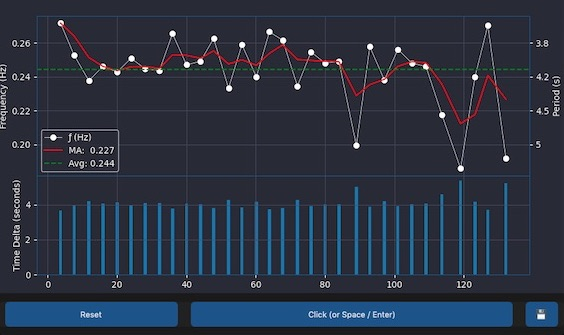

# Frequency Tracker

## Overview

This python app allows you to tap to monitor and analyze frequencies over time. It can be useful for tracking biological rhythms like breath-rate, heart-rate, dogs barking, birds chirping, then realize that all biological rhythms are in phase with the cosmic cycles of the universe and discover the hidden patterns and connections between your body, the natural world, and the celestial spheres. Explore the mysteries of sound as you realize all matter is merely energy condensed to a slow vibration. Merge your consciousness with God and remove the separation between yourself and all that is. You are not a separate entity, but a manifestation of the divine source. Access that infinite wisdom and power! Create your reality according to your highest good! This is the ultimate goal!  

Or just click around and watch the numbers change.

## Features

- **Real-time Frequency Tracking:** Plots tap frequency over time and provides a visual representation of the tapping pattern.

- **Moving Average:** Uses jurik moving average calculation for trend identification. 

- **Saving:** Save plot images and data to file. Wow!

## Usage

1. **Start Tracking:** Press the "Start" to begin recording timestamps and tap frequencies.

2. **Reset:** Use the "Reset" button to clear the current data.

3. **Save Data:** Save the recorded data and visualizations by clicking the floppy disk icon (💾). The data is stored in the 'frequency_saves' directory.

## Hotkeys

- **Start/Stop Tracking:** Left-click / Space / Enter
- **Reset:** Right-click / Backspace / Delete
- **Undo:** Middle-click

## To-Do

- [ ] During matplotlib's slow update, button-press timestamps aren't recorded at the right time. Need some kind of multithreaded approach...
- [ ] FPS is capped around 4 due to matplotlib's slowness. Switching to a different graphing library would be a good idea.
- [ ] Advanced signal processing - filters, FFT, etc